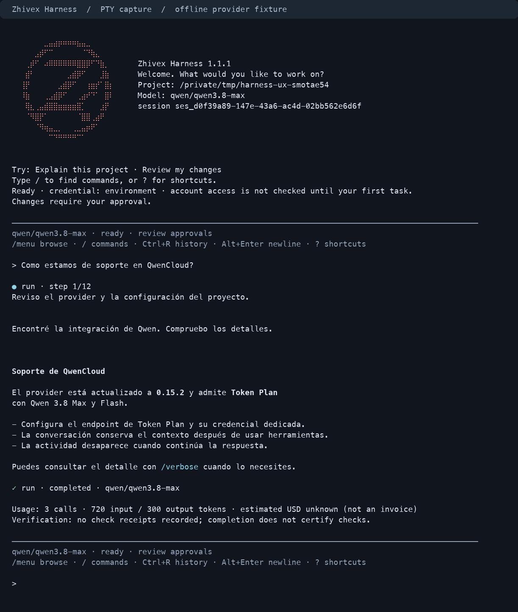

# CLI reference

## Tasks, help and profile updates

Append `--help` to a command even when it already includes a task or options:
`zhx run --provider openai "task" --help`. Help does not load profiles, read stdin,
or contact a provider. Value options also accept `--model=<id>` syntax.

Use `zhx run -` or `zhx review -` to read a task explicitly from stdin:

```sh
git diff | zhx run -
zhx review --profile daily - < review-task.txt
zhx init --profile daily --update --model <id>
```

Stdin must contain nonempty UTF-8 text, up to 1 MiB. It preserves multiline content;
`-` cannot be combined with another task argument. Piping does not approve actions.
Without `-`, the task comes from positional arguments as before.

`init --update` replaces an existing personal profile atomically, preserving its
provider/model when omitted. Selecting a different provider defaults to that
provider's model. Without `--update`, an existing profile is never overwritten.
Bare interactive launches use the saved default profile without confirmation.
Use `zhx init --update --provider qwen` to make Qwen the default for future launches.

For setup, read [First use](FIRST_USE.md). `zhx --help` is the short guide;
`zhx run --help` and `zhx sessions list --help` show only that command’s options.
`zhx help all` retains the full reference. Inside the console, `/help` shows common
actions and approvals, while `/help all` includes advanced commands. Typing `/`
shows common actions; typing a search term searches the full supported catalog.

Session discovery: `zhx sessions list --workspace <project> --search <text>` filters
literal title/ID substrings before applying `--limit`. In the console use
`/sessions [text]`, `/rename <title>` and `/resume <sessionId>`; reopening shows
the durable status and pending approval payloads before a new task is accepted.
`/context` shows active rules, available skills, attachment selection, exclusion
policy and compaction limits. Attach/detach affects the next request; old excerpts
remain in conversation history until a new session. Modified attachments must be
reattached. Credential presence in `doctor` does not validate credentials live.

### Transport usage and monetary limits

Console `/usage` and run JSON `usageLedger` expose usage by API provider/model.
Calls are recorded before transport in the private operations SQLite database;
SDK child rollups are not added a second time. Missing usage and interrupted calls
remain incomplete across restarts. A run's original price snapshot and cap survive
`resume`; a new chat turn starts a new run budget, not a cumulative session budget.

Use `--pricing-file <file.json> --usage-limit-usd <amount>` for a per-run monetary
limit across parent and child routes. The file is a schemaVersion 1 object with a
`prices` array: each entry specifies `provider`, `model`, `inputUsdPerMillion`,
`outputUsdPerMillion`, `source`, `asOf` and `expiresAt` (UTC ISO timestamps).
Prices are operator-supplied estimates, never confirmed invoices. Missing/expired
prices or unresolved usage block new budgeted calls. The next request reserves
estimated input and capped output before transport; parallel calls share the cap.
Input prediction is heuristic; it is not a provider tokenizer or billing guarantee.
Actual usage above the estimate is retained and blocks further calls if exhausted.
Cache discounts and special billing tiers are not modeled; configure conservative
inclusive rates. Qwen routes without an explicit supported output cap are blocked
under this monetary policy. Unpriced non-budgeted runs report unknown cost.
Legacy `--max-cost-usd` pricing remains available with its existing homogeneous-route
restriction; do not combine the two monetary policies.
Resume of pre-ledger runs marks historical usage unknown. Importing only a run
snapshot cannot reset an existing ledger budget: restore the complete state backup.

The Zhivex Harness `1.0` release is Node-first and exposes a durable agent console, explicit personal provider/model profiles, bounded project context, offline change-envelope operations, plus versioned JSON documents and JSON Lines events for automation. Bun remains a supported target-repository package manager and contributor tool.

## Commands

Start with `zhx`. Use `/help` inside the conversation. For scripting, use `zhx run`; `runs`, `state` and `changes` are advanced administration commands. `zhx chat` and the long executable name `zhivex-harness` remain compatible aliases.

### Interactive daily workflow

The console opens with the Zhivex logo and a compact welcome panel. Project/model context sits beside the logo when space permits. Before each task, the composer shows the model, approval mode, pending approval state and attachment count. Long labels are bounded to the terminal width; full configuration remains available through `/status`. Type `/` to open the command menu; keep typing to search names and descriptions, use Up/Down to select, Tab to insert, and Enter to submit. Escape dismisses the menu. Enter on a partial command inserts its selection; a separate Enter submits it, including approval commands. Only commands supported by the connected runtime appear. Narrow terminals use a compact logo; `NO_COLOR` disables logo color. The console completes slash-command prefixes with Tab. `/paste` captures a bounded
multiline draft: finish with `.end` on a separate line, review the preview, then type
`send` at the separate confirmation prompt. Slash commands inside the draft remain
literal model input. Use this mode when the terminal does not support bracketed
paste. With bracketed paste, clipboard content is inserted as a literal editable
draft; a separate Enter sends it. Pasted slash commands never execute console
commands, and pasted answers never approve changes. Clipboard controls are escaped,
and an oversized clipboard is discarded while retaining the existing draft.
Lines arriving
without an active question are discarded, including surplus lines after a task or
approval answer; they are never queued as future approvals. Input history is not
saved to disk or shared with approval questions. At the edges of multiline input, Up/Down recall the last 100 task
prompts in this process (at most 256 KiB); `/clear` and session switches clear them.
Ctrl+R searches that in-memory history. Type a filter, use Up/Down to choose, then Enter or Tab to restore the draft without sending it. Escape restores the original draft. Pasted slash commands keep their literal status when recalled. `?` on an empty draft shows keyboard shortcuts; press it again to type a literal question mark. Alt+Enter inserts a newline without submitting. Up/Down move between explicit lines before reaching history. Drafts are limited to 64 KiB.
Left/Right and Home/End edit the draft in the supported Node terminal runtime;
resizing the terminal preserves it. Ctrl+C discards the current draft (including
an unfinished paste), or cancels the active operation and returns after cleanup.
During an operation, typed input is ignored without echoing over the stream.

Text streams progressively, including partial lines during provider pauses. Activity,
approval requests and completion remain separate labelled events. Partial output is
flushed before errors or returning to the prompt, and terminal controls from the
provider are escaped. After a provider error, Up recalls the submitted task for
editing/retry; history stays in memory only. Markdown emphasis and inline code wait for a matching closing marker within a bounded
span. Unclosed markers are preserved literally when interrupted, at a newline, or
at the size limit. Ordinary text is coalesced into short frames and never replayed.

Reproduce this flow offline with `bun run build` followed by
`python3 scripts/console-pty-smoke.py` (Python 3 and Node on macOS/Linux). The PTY
fixture covers paste, navigation, resize, partial provider failure, recovery,
cancellation and approval safety without sending requests to a live provider.

`/context` displays the exact active project manifest, rule/context paths, digests,
and available skills. Skills are indexed for progressive loading; the list does not
claim every skill has already been loaded into the conversation.

Use `/attach <workspace-relative path>` to select an excerpt for the next task,
`/attachments` to inspect the selection, and `/detach [path]` to remove one or all.
Paths may contain spaces. Attachments use the existing secret-excluding workspace
reader, cover at most the first 400 lines per file, and are limited to eight files
and 64 KiB of excerpt text. They are explicitly labelled untrusted file data in the
model request. A changed digest requires reattachment before sending. Successful
turns, `/clear`, and session switches clear the pending selection; errors retain it.
Attachments are sent to the selected provider with the next ordinary task, not to
`/review`. They are not new project rules or a grant of tool authority.

Ctrl+C discards pending input, or signals the active model/review operation to stop
and waits for runtime cleanup. At an approval prompt it leaves the complete batch
pending. `/pending`, `/approve`, and `/deny` retain their durable meaning. Provider
and command errors return to the console with the saved run status instead of
closing the session. Interruption does not undo completed edits or replay tools;
use `/status` and `/diff` before continuing. The runtime's persisted terminal status
remains authoritative. An externally aborted ordinary turn that settles as failed
is recorded as `cancelled`; completed work, timeouts, and pending approvals retain
their status. Review groups retain the status reported by their group runtime.

`/diff` colors additions, removals, and hunk headers on eligible terminals, respects
`NO_COLOR`, and escapes untrusted terminal controls. Model text also escapes terminal
controls and renders bounded Markdown headings, emphasis, and fenced code on a
TTY. Tables with leading pipes and a Markdown separator row render with aligned
borders and wrapped cells at the current terminal width; narrow terminals use
stacked labels and values. Table blocks buffer up to 128 lines (8 KiB per line)
before rendering; incomplete or oversized syntax stays readable as literal text.
Redirected output and JSON/JSONL retain their existing data contracts.

Contributor validation: `bun run smoke:package` also runs a real PTY workflow
against the installed CLI, including approval recovery after process restart.
This Linux/macOS test requires Python 3 and injects a process-local fetch fixture;
it makes no provider requests. Run `python3 scripts/console-pty-smoke.py` after a
build to exercise the source artifact directly. `bun run smoke:console` also covers first-run setup, saved profiles, machine output in a TTY and the local-service console with an offline provider fixture. Python is not a CLI dependency.

```text
zhx
zhx init [--profile <name>] [--provider <id>] [--model <id>] [--json]
zhx run --route reviewer=gemini [options] "task"
zhx run --jsonl [options] "task"
zhx chat [--continue|--session <sessionId>]
zhx sessions list|inspect|rename|fork|archive
zhx run [options] "task"
zhx review [options] "review task"
zhx chat [options]
zhx providers [--json]
zhx doctor [options] [--json]
zhx resume [options] <runId> --approve|--deny
zhx runs list [--status <status>] [--limit <n>] [--cursor <cursor>]
zhx runs inspect <runId>
zhx runs export <runId>
zhx runs cancel <runId> [--reason <text>] [--cascade] [--final]
zhx runs cleanup --before <date|timestamp> [--status <status>] [--limit <n>]
zhx changes create <input.json> --patch <artifact>
zhx changes verify <envelope.json> --patch <artifact> [--preconditions <file>] [--now <ISO-8601 UTC>]
zhx state status
zhx state export <backup.json>
zhx state import <backup.json> [--apply]
zhx --version
zhx --help
```

## Command compatibility

`zhx` and `zhivex-harness` point to the same installed executable. The short command is the primary interactive UX; the long command remains supported for existing scripts. Running `zhx` with no arguments in a TTY opens the console. `zhx --continue` and `zhx --session <id>` reopen conversations. `zhx --service <credentials.json>` also opens the console in a TTY; the service host owns provider/model/policy configuration. An implicit prompt such as `zhx "inspect this repository"` and explicit `zhx run` remain one-shot executions.

Options are command-specific. The exported `CLI_COMMAND_OPTION_CONTRACTS` manifest is the machine source of truth for allowed, required, repeatable, and conflicting options. A known option used with the wrong command, a repeated scalar option, an invalid enum/range, or an unsupported option fails with `CLI_USAGE_INVALID` and exit code `2`; options are never silently ignored.

The checked option inventory includes `--provider`, `--model`, `--profile`, `--workspace`, `--state-dir`, `--store`, `--tenant`, `--user`, `--namespace`, `--idempotency-key`, `--max-steps`, `--timeout-ms`, `--max-tool-calls`, `--max-tool-errors`, `--max-input-tokens`, `--max-output-tokens`, `--max-total-tokens`, `--input-cost-per-million`, `--output-cost-per-million`, and `--yes`, in addition to the command-specific flags documented below. The preparation gate rejects a help or documentation inventory that omits a declared option.

## First-run initialization and profiles

`zhx init` creates one explicit personal profile. In a terminal it asks for provider and model when they are not supplied; in scripts it uses flags, environment values, and deterministic provider defaults. The default profile name is `default`.

```bash
zhx init
zhx init --profile daily --provider qwen --model qwen3.8-max
zhx doctor --profile daily
zhx --profile daily "inspect this repository"
```

Profile schema `1` contains exactly `schemaVersion`, `provider`, and `model`. It cannot contain credentials, endpoints, approval policy, workspace/state scope, MCP, checks, OCI policy, routes, or subagents. Files are stored outside the repository under the platform user configuration directory (`~/Library/Application Support/zhivex-harness/profiles` on macOS, `${XDG_CONFIG_HOME:-~/.config}/zhivex-harness/profiles` on Linux, and `%APPDATA%/zhivex-harness/profiles` on Windows). `ZHIVEX_HARNESS_CONFIG_DIR` is an explicit absolute-path override for isolated automation and tests.

Profile names use 1–64 letters, digits, dots, underscores, or hyphens. Directories must not be writable by group or others; files are created with mode `0600`, read through a no-follow descriptor, limited to 16 KiB, and rejected when linked, malformed, over-permissive, or already present. Explicit `zhx init` only creates a profile; the subsequent interactive console manages keys separately. Initialization reports only the accepted credential variable names and whether one is present.

Interactive `zhx`, `zhx chat`, and `zhx doctor` automatically use the saved `default` profile when no profile, provider, model, provider/model environment override, or resumed session is selected. The validated provider/model is retained for this invocation even if the saved profile changes after startup. With no default profile, a single configured environment provider is selected automatically. With none or several, the console offers searchable provider/model selection and saves `default`; those answers explicitly select it for the current invocation. Cancelling the selector leaves profiles unchanged. The interactive console then resolves credentials from the environment, a temporary key, or the system keychain, and offers hidden entry if needed. See [Credentials](CREDENTIALS.md). One-shot execution, other administrative commands and service connections do not activate profiles implicitly. `doctor`, including `--json`, follows the conversation defaults. `--profile <name>` is accepted only by `run`, `chat`, `review`, and `doctor`; it is intentionally rejected by `resume` because an existing run restores its exact persisted configuration. An explicit profile supplies provider/model defaults overridden by CLI flags. Otherwise, explicit provider/model flags or provider/model environment overrides bypass automatic profile selection; then the saved default profile wins over single-provider environment detection and built-in defaults.

## Interactive console

For the rationale and reference patterns, see [Console UX](https://github.com/Zhivex/zhivex-harness/blob/main/docs/CLI_UX.md). `bun run dev` builds with Bun and launches the Node CLI so repository usage and the installed terminal editor behave consistently.

`/menu` opens the navigation menu: Providers → Models, Models for the current provider, Conversations, Status, Pending approvals, Project context, Usage and Help. Up/Down moves through the list, typing filters it, Enter chooses, and Escape returns to the parent menu. Browsing or going back never changes the selected provider/model; choosing a model applies the pair together. Provider/model changes remain blocked while a run or approval is active.

`/provider` (also `/providers`) opens Providers directly. `/model` (also `/models`) lists the active provider's models; a Custom model ID option supports IDs outside the snapshot. The offline catalog is derived from the Zhivex SDK's chat-and-tools recommendations, excludes dedicated live/audio/image transports, and records provider revisions and source hashes. It is not a live account entitlement list or model certification. Refresh with `bun scripts/generate-console-models.ts <sdk-checkout>`; the generated snapshot ships with the CLI and needs no sibling repository at runtime.

`/resume` opens the searchable conversation menu; `/resume last` and `/resume <id>` remain shortcuts. `TERM=dumb` and non-TTY selection fall back to numbered lists. The service console offers navigation for conversations and session tools; provider/model policy remains with the service host.

Activity is compact in the direct console: tool actions appear only as a temporary TTY status; approvals, errors and final run status remain visible; repeated provider and per-step transport notices are hidden. `/verbose` toggles full activity for that console process. One-shot and JSON/JSONL outputs retain their contracts.

The agent is instructed to give brief progress updates unless the requested output format or silent execution prevents them; their frequency depends on the model. Model text is shown in compact mode too. Direct CLI runs and continuations return unknown tool names as error receipts so the model can select an exposed tool. Unknown tools are never executed or aliased, and error/step budgets and approval requirements still apply. Library callers retain their configured tool-error policy.

Each console session is a scoped, durable chain of immutable run IDs. The session index stores provider/model/status metadata and never stores prompts, model messages, tool payloads, or provider data; those remain in the governed run store. `zhx chat --continue` opens the latest session and `--session <id>` selects one explicitly.

```text
/provider [id]                 /model [id]
/route [role=provider[:model]] /route clear [role]
/status                        /diff
/review <task>                 /resume <last|sessionId>
/pending                       /approve | /deny
/compact                       /new [title]
/rename <title>                /clear
/help                          /exit
```

Provider/model changes apply only to the next run. The console blocks them while the current run has an unresolved approval. Before a cross-model handoff it replaces future context with a bounded deterministic summary that redacts common credentials and retains tool names but not tool inputs or outputs. It never rebinds an existing run to another provider.

`/resume` selects a conversation session and restores its exact persisted provider, routing, context, and execution policy. `/pending` renders the current approval card without executing it; `/approve` or `/deny` continues that durable run inside the console. The operator command `zhx resume <runId> --approve|--deny` remains available for scripts and out-of-process operation.

Human terminal mode renders redacted step/tool lifecycle lines and never prints tool inputs, outputs, provider payloads, or raw errors. Governed edits, checks, argv commands, and OCI shell scripts show their complete sanitized approval payload; unknown provider/MCP tools use a bounded summary with an explicit full view. `q`, EOF, or interruption leaves the entire approval batch pending.

`doctor` is local and makes no provider or MCP request. It checks environment credentials first and otherwise inspects the selected provider keychain entry. Human output focuses on that provider and names the active profile, model, project and credential source; JSON retains all provider checks. Presence does not verify account access. It checks the active Node/Bun runtime, detected repository package manager, workspace, Git, supported package scripts, state-directory safety, provider credential presence, endpoint shape, provider configuration, the local MCP configuration file, and—when requested—the OCI runtime and preloaded image without returning secret or endpoint values.

`--allow-check <script>` is repeatable and replaces the default check allowlist for that invocation. Values are declared `package.json` script names, never command text.

Project context discovery reads a root `AGENTS.md` and the optional `.zhivex/harness.json` manifest. Use `--context-config <path>` to choose another workspace-contained manifest or `--no-project-context` to disable both. Context/rules are bounded and fingerprinted; skills expose metadata first and their instructions only through `load_skill`.

`--require-capability <name>`, `--subagent <profile>`, and `--reviewer <explorer|reviewer>` are repeatable. `--mcp-config <path>` loads a schema-versioned file inside the canonical workspace. Child limits use `--subagent-max-steps`, `--subagent-max-tool-calls`, `--subagent-max-tool-errors`, `--subagent-max-input-tokens`, `--subagent-max-output-tokens`, `--subagent-max-total-tokens`, and `--subagent-timeout-ms`. Parallel review is capped by `--max-parallel-reviews`.

`--route <profile=provider[:model]>` is repeatable for `explorer`, `implementer`, `tester`, and `reviewer`. Omit the model to use that provider's default. Duplicate roles and unknown providers fail before a model is created. Only routed roles are instantiated. `--max-cost-usd` cannot be combined with routes in `1.0`, because the current budget has one operator-supplied price pair and cannot price heterogeneous child usage accurately.

`review` is application-owned parallelism and accepts only read-only explorer/reviewer members. Its execution limits are the `--subagent-max-*` and `--subagent-timeout-ms` child limits; parent `--max-*`/`--timeout-ms` budgets, MCP, OCI, check allowlists, automatic approval, and extra `--subagent` profiles are rejected rather than accepted without effect. Model-directed delegation occurs only inside `run` or `chat` when the parent invokes an enabled `delegate_<profile>` tool.

Enforced execution is opt-in:

```text
--execution <none|oci>
--oci-runtime <docker|podman>
--oci-image <reference>
--oci-allow-command <bare-name>
--oci-shell <deny|ask>
--oci-max-process-runtime-ms <n>
--oci-max-process-output-bytes <n>
--oci-max-memory-mb <n>
--oci-max-pids <n>
--oci-max-cpus <n>
--oci-max-workspace-bytes <n>
--oci-max-file-write-bytes <n>
--oci-tmpfs-mb <n>
```

`--oci-allow-command` is repeatable, replaces the default executable allowlist, and must include at least one supported repository package manager: `npm`, `pnpm`, `yarn`, or `bun`. The default is `node,npm`; custom images must still provide Node for the internal controller. Commands are exact argv arrays, never shell strings. See [EXECUTION_ENVIRONMENTS.md](./EXECUTION_ENVIRONMENTS.md).

`--oci-shell` defaults to `deny`. `ask` exposes `run_environment_shell`, whose complete script requires durable approval and runs as `sh -lc` inside the acquired no-network container. It does not add a host shell, enable networking, or remove the separate host patch-import approval. The entrypoint allowlist constrains the command requested from the container runtime; it is not a kernel-level descendant-process allowlist.

## Change admission

`changes create` and `changes verify` are local operator commands. They do not load a provider, inspect a repository, run checks, apply a patch, or contact a network service. Both require `--patch <artifact>` so the envelope is checked against exact bytes rather than a filename or mutable logical ID.

`create` accepts a strict JSON input, fills `patch.patchDigest`, and emits one canonical `change-envelope` JSON document. `verify` emits a `change-envelope-verification` document and can require expected bindings through `--preconditions <file>`. It returns exit `1` for an integrity, expiration, exact-patch, or precondition failure. `--now` exists for deterministic replay; omit it for normal admission.

The verifier never claims signer identity. Approval and attestation references remain `authenticity: "not-verified"` until an external trust verifier validates the referenced artifact. See [CHANGE_ENVELOPES.md](./CHANGE_ENVELOPES.md).

## Exit codes

| Code | Meaning |
| --- | --- |
| `0` | Command completed successfully. |
| `1` | Runtime, provider, agent, or change-admission verification failure. |
| `2` | Invalid CLI usage. |
| `3` | `doctor` found a blocking configuration problem. |

Agent results with status `failed` or `timed_out` return `1`. A paused approval is a valid durable result and does not imply a runtime failure.

Every new CLI run persists its resolved, non-secret harness configuration with the durable state. The printed resume command includes the canonical workspace, state-store backend, and scope locator; after loading the run, `resume` restores the original execution policy, including every OCI image, runtime, allowlist, and resource limit, before validating the harness fingerprint. Explicit conflicting resume options still fail closed. Runs created before this metadata existed must repeat their original policy options manually.

Operator commands do not construct a provider model and do not require provider credentials. They must use the workspace, state directory, backend, and scope that own the target run. `cancel` creates a cooperative cancellation request by default; `--final` writes a terminal cancellation. `cleanup` requires an explicit cutoff and defaults to terminal statuses only.

## State backup and restore

`state status`, `state export`, and `state import` are provider-free. Export creates a logical schema-1 snapshot under a SQLite `BEGIN IMMEDIATE` transaction, so WAL state is captured consistently without copying mutable database files. Backups use owner-only permissions, a strict schema, an SHA-256 payload checksum, and immutable workspace/scope bindings. They contain terminal runs, tool journals, idempotency and parent relationships, memory, and terminal session lineage; leases, active runs, and pending approval authority are rejected.

Import verifies the file type, link count, permissions, schema, checksum, bindings, and referential integrity before opening a write transaction. It is a dry-run unless `--apply` is present. Empty destinations are the normal path, identical records are no-ops, conflicting IDs fail closed, and any write failure rolls back the entire import. The checksum detects accidental or post-export modification; it is not a signature or proof of who created the backup.

The literal durable `userId` value `"*"` is reserved as the absent-user scope marker and is rejected during configuration. This prevents an explicit user from colliding with tenant-wide run, journal, or memory keys.

## JSON schemas

All structured documents include:

```json
{
  "schemaVersion": 1,
  "kind": "init | providers | doctor | run-result | review-group | run-list | run-inspection | run-export | run-cancellation | run-cleanup | session-list | session | change-envelope | change-envelope-verification | state-status | state-export | state-import | error"
}
```

The exported `parseCliJsonDocument`/`cliJsonDocumentSchema` and `parseCliJsonLineDocument`/`cliJsonLineDocumentSchema` parsers retain additive observational fields within schema version `1`. Removing a field, changing its meaning, or changing a field type requires a new schema version and a migration note. Digest-bound change-envelope and edit-contract schemas remain strict because extra bytes alter the identity being approved. Human-readable output and error messages are not machine contracts.

Machine errors emit only stable `code`, `category`, and `retryable` fields. Messages, causes, stacks, provider payloads, and configuration values are excluded from JSON/JSONL error records.

Provider diagnostics include credential variable names and boolean presence only. Endpoint diagnostics include validation booleans only. Neither contract contains credential values or endpoint URLs.

`run-result.mutations` contains the mutation audit entries produced by the current harness process. `run-result.children` reports bounded child identity, status, steps, tool/error counts, and usage without raw child messages or tool payloads. Capability evidence, configured MCP server names, and the execution backend/binding/image are included. `review-group` contains a group ID and one bounded member result. Operational inspect/export documents are redacted and do not include raw messages, tool inputs/outputs, approval arguments, metadata, or full output text; `run-inspection.hierarchy` adds the redacted run tree. Tool-level repository-editing documents use their own schema version `1` and kinds such as `edit-proposal`, `patch-result`, `mutation-audit`, and `workspace-diff`; see [REPOSITORY_EDITING.md](./REPOSITORY_EDITING.md).

## JSON Lines

`--jsonl` is available for `run` and approval `resume`, and is mutually exclusive with `--json`. Every event line has `schemaVersion: 1`, `kind: "run-event"`, a monotonic `sequence`, and an event `type`. A separately projected compact `run-stream-result` is emitted as the final sequenced line; its distinct kind prevents ambiguity with rich JSON `run-result`. It contains only run identity/status, step/tool counts, redacted approval identity, and child run identity/status. It omits output text, mutations, approval arguments, paths, scope, provider payloads, and configuration bindings. A machine-readable streaming failure uses `run-stream-error`.

The event projector allowlists safe fields. Text deltas and token usage are retained; tool IDs/names, approval IDs, status, step counts, compaction counts, and provider/model identity are allowed. Tool inputs/outputs, approval arguments, provider payloads, image content, full durable states/messages, raw errors, stacks, and telemetry metadata are omitted. Consumers must still treat model text as untrusted application data.

## Configuration schema

Resolved library configuration includes `schemaVersion: 5`, an explicit `allowedChecks` array, `storeBackend`, `scope`, parent `budget`, `compaction`, `requiredCapabilities`, project `context`, optional `mcpConfigPath`, an `orchestration` object with profiles, child budget/timeout, and review concurrency, and a discriminated `execution` policy. The check default is `test`, `typecheck`, `lint`, and `build`; `--allow-check` or `ZHIVEX_HARNESS_ALLOWED_CHECKS` replaces that set. Execution defaults to `{ backend: "none" }`; an OCI policy records the runtime, image, allowed entrypoints, shell mode, and every resource ceiling. Passing a different explicit schema version fails before a model or tool can run. During `0.x`, a minor release may add a new schema version with a documented migration; patch releases remain compatible.

Personal CLI profile schema `1` is separate from resolved Harness configuration schema `5`. Selecting a profile only supplies provider/model input before normal resolution; it does not change persisted run schemas, execution fingerprints, project-context discovery, or migration guarantees.

The default state directory is `<workspace>/.zhivex-harness/runs` and the default backend is scoped SQLite at `operations.sqlite`. Explicit external state directories are supported, but the workspace root, filesystem root, sensitive workspace paths, regular files, and symbolic-link targets are rejected before the run store is created. See [DURABLE_OPERATIONS.md](./DURABLE_OPERATIONS.md) for state migration and operations, and [EXTENSIBILITY.md](./EXTENSIBILITY.md) for capability, MCP, subagent, and review-group configuration.

### Required verified delivery

The assistant uses one general-purpose execution loop with bounded schema/tool
recovery and cumulative accounting. `--require-verified-delivery` adds an explicit
completion obligation, exploration controls and up to two retries of recoverable
approved verifier failures. A successful
approved verification/import can finish from its durable receipt. It does not
auto-approve tools, bypass checks, or recover cancellations/integrity violations.
The delivery requirement is persisted in resume configuration and the harness binding.
The former `--agent-profile`, `agentProfile` and `ZHIVEX_HARNESS_AGENT_PROFILE`
configuration have been removed; there is no profile alias. Saved connection
profiles (`--profile`) and optional subagent roles are independent and unchanged.

```sh
bun run src/cli.ts run "Fix the regression and verify it" --require-verified-delivery --execution oci
```

Library callers select `requireVerifiedDelivery: true` in `createHarness` and can observe
bounded timings/accounting with `runHarness(..., { onDiagnostics })`. Telemetry
observer exceptions do not alter the execution result. A stricter caller can
explicitly override tool-error behavior or terminal receipt settings.

## Shared local service (experimental)

Use `--service /absolute/private/credentials.json` with `run`, `resume`, `chat`, or
`sessions list|inspect|rename`. The host starts the service as described in
[LOCAL_SERVICE.md](LOCAL_SERVICE.md). The CLI reads its private credential file;
it never prints the token or starts another engine in service mode.

```sh
zhx run --service /private/service/project.json --json "Explain this repository"
zhx run --service /private/service/project.json --session ses_example --jsonl "Continue"
zhx resume run_example --service /private/service/project.json --session ses_example --approve --jsonl
zhx sessions list --service /private/service/project.json --json
zhx chat --service /private/service/project.json --continue
```

Runtime/provider/workspace policy flags are rejected in this mode because the host
owns them. Commands without `--service` retain their existing direct behavior.
`--session` on `run` or `resume` is specific to service mode. JSON uses the existing
schemaVersion 1 documents (run JSON adds sessionId); JSONL retains monotonically
sequenced run-event and run-stream-result records. Pending approval is exit 0,
failed/cancelled/timed-out runs and transport/state errors exit 1, usage errors exit 2.
Service sessions preserve full session documents. `/help` lists the service chat
commands; host configuration commands remain available through direct mode.

Streaming follows durable replay pages without running effects client-side. Ctrl+C
requests cancellation with the run's current revision. Disconnecting the CLI does
not shut down the service. After a service restart read the rotated credentials,
inspect the session and explicitly resume its current pending approval. Do not
blindly retry an uncertain command with a new idempotency key. The host persists the
CLI result projection for runs executed through this adapter; older runs without
that projection can be inspected through run/session queries but are not synthesized
into a new CLI result. Approval output remains untrusted repository text.

### Compact tool activity

Interactive chat keeps successful tool bookkeeping out of the conversation.
On a TTY, one temporary line shows Reading files, Exploring the project, or Thinking
and is erased before the next assistant text. Redirected compact output omits this
status entirely. `/verbose` restores individual tool events.
Tool failures, check receipts, and approval requests remain individually visible.
Budget and step-limit failures show their known runtime cause; arbitrary provider
error payloads are not printed in activity events.

Qwen runs without subagents enforce cumulative token usage after each model
response and before executing its tools, including usage retained across approval
resume. This local guard does not inject a `maxTokens` transport parameter for
Qwen. A response can itself cross a token limit; the guard prevents its tools and
subsequent model calls, rather than guaranteeing a pre-request input-token ceiling.

### Runs without cumulative token budgets

New local interactive sessions (`zhx` or `zhx chat`) have no cumulative token
ceiling by default. Automatic compaction continues, and usage is measured and
persisted. This avoids ending a repository analysis solely because repeated
requests have consumed 100,000 input tokens.

`zhx run`, `zhx review`, SDK callers and service hosts retain their bounded
defaults. Use `--token-budget` in the local console to opt into those budgets.
Explicit numeric token flags or token-limit environment variables also enable
bounded console execution unless `--no-token-budget` is explicitly supplied.
Saved conversations retain their stored policy, including older bounded sessions;
start a new session to use the new default.

`--no-token-budget` disables cumulative input, output and total token ceilings for
the main run and children, including token closure reserves. Numeric settings remain
stored but inactive. Step/tool limits, timeouts, monetary limits and approvals still
apply. Library callers use `unlimitedTokens: true`; `false` restores token limits.

`--context-tokens <n>` sets the estimated context compaction threshold independently
of cumulative usage. The default is 40,000. It can be adjusted for the selected model;
it does not change the provider's actual context window. The local catalog does not
yet declare verified model context windows, so the harness does not infer larger
windows from model names. Saved sessions preserve this threshold.

`/context` shows the estimated retained conversation size (excluding additional
request instructions and tool schemas), compaction settings and budget mode.
`/usage` shows the latest run's cumulative input/output usage and remaining budget
separately from the transport ledger. Unknown usage is not reported as zero.

Examples:

```sh
zhx
zhx --token-budget --max-input-tokens 200000 --max-total-tokens 230000
zhx --context-tokens 100000
zhx run --max-input-tokens 200000 --max-total-tokens 230000 "Analyze the repository"
zhx run --no-token-budget "Analyze the repository"
```

### Conversation preview



This image is rendered from the real CLI's PTY screen with an offline provider
fixture and real read-only workspace tools. It is a presentation test, not live
Qwen certification. Reproduce it after `bun run build` with Python 3, `pyte==0.8.2`
and Pillow installed:

```sh
python3 scripts/capture-console-ux.py /tmp/cli-conversation.png
```

The capture writes a PNG and its raw ANSI transcript next to it; both contain only
the disposable fixture session. No provider request leaves the process.

### Approval modes

Local `zhx` and `zhx run` accept `--approval-mode ask|auto|restricted`:

- `ask` (default): ordinary permitted reads run directly; approval-gated actions
  prompt in a terminal and remain pending without a terminal.
- `auto`: approves actions within the existing workspace, command and execution
  policies. `--yes` remains its alias. Neither option removes protected paths.
- `restricted`: rejects approval requests without prompting; the agent can use
  already permitted tools and report what it could not complete.

`--approval-mode` and `--yes` cannot be combined. Service clients cannot override
host approval configuration with this option.

`read_dependency` is a separate approval-gated read tool for installed packages.
It accepts a package name, a package-relative `package.json` or TypeScript
declaration file (`.d.ts`, `.d.mts`, `.d.cts`), and a starting line. Package
manifests expose versions and exports; arbitrary source, scripts and writes are
not allowed. Reads are capped at 1 MiB input and 200 lines / 16,000 characters
output. Symbolic links, directory links and multiply linked files are rejected;
linked package-manager layouts may therefore require another inspection route.

Dependency access asks even in automatic mode: approve once, approve metadata
and declaration reads for that package during this task, reject, or leave
pending. Task grants are held only by the current approval resolver, scoped by
provider and child agent; another task or process restart asks again. They do not
grant execution or writes. Without a terminal an unapproved dependency request
remains pending; restricted mode rejects it.

In the console, `run` command, SDK harness and delegated runs, tool errors, including protected reads and denied approvals, return
evidence to the model so it can choose another permitted strategy. Existing
tool-error, step and time budgets bound recovery. Validation and security
checks still reject the underlying action. Invalid arguments and unknown tool
names produce structured error receipts; neither is executed. This recovery is
independent of the optional `repair` controller, so a normal coding session does
not need a verifier plan for every task. Library callers that need fail-fast
behavior can explicitly pass `toolExecution: { stopOnError: true,
validationErrorMode: "throw", unknownToolMode: "throw" }`.
The client protocol's `approval.resolve` command remains fail-fast for the
specific reviewed effect, so denial or stale content cannot be acknowledged as
a successful decision. A subsequent turn can continue from that failed attempt.

```sh
zhx --approval-mode ask
zhx --approval-mode auto
zhx run --approval-mode restricted "Analyze this repository without additional permissions"
```

### Interactive connection and approval settings

Use `/menu` → Credentials to configure Qwen Standard API or QwenCloud Token Plan,
with the matching region and hidden key. `/connection` optionally tests the current
model with a small billable request. See [credentials](CREDENTIALS.md).

`/approvals` opens the mode picker; `/approvals ask`, `/approvals auto`, and
`/approvals restricted` switch directly. The composer and `/status` show the active
mode. Auto approves gated actions but still asks for dependency access. Restricted
denies gated actions. Mode changes apply only to this CLI process and are blocked
while work is active or awaiting approval; use `/pending`, `/approve`, or `/deny`
first. Service-connected consoles retain host-controlled policy.

### Conversation presentation and step limits

The local console groups transient tool activity on one line and shows approval
cards with a keyboard picker. Check approvals retain the exact script and workspace;
IDs and input hashes are available through **View technical details**. Reviewed
edits retain their complete payload. Cancelling the picker leaves the batch pending.
`/verbose` retains the detailed event view; JSONL output retains its event contract.

New local conversations, API runs, automation, and service runs default to a finite
limit of 50 model iterations per turn. Explicit
`--max-steps` and `ZHIVEX_HARNESS_MAX_STEPS` take precedence. Saved runs retain their
limits. `/limits` opens a picker and `/limits 100` sets the limit for subsequent
turns. Step limits accept any positive safe integer, with no separate ceiling of 50.
Explicit parent and child step/tool-call budgets can exceed the former configuration
ceilings; defaults remain finite and tool calls still accept zero to prohibit calls.
Active runs and pending
approvals must be resolved first. More steps can increase API costs; other budgets
still apply. A failed run reaching its step limit now shows the persisted cause
and the current/maximum counts. Continue with a new message after adjusting the
limit; this does not rewrite the failed run or certify unfinished work.

Compact activity remains visible while the model is silent: the terminal shows
its current step and elapsed wait, followed by grouped counts of completed tool
operations. Successful reads and searches remain in the transcript instead of
being erased. Tool arguments, file contents, and private reasoning are not printed
in these progress summaries. Checks and errors retain their separate receipts.

### Interactive continuity and session permissions

New local `chat` sessions default to 50 model steps, 200 tool calls, 20 tool
errors and 60 minutes per run. Explicit CLI/environment limits and saved run
policies take precedence. Automation and service share the 50-step default but
retain their separate tool, token and time budgets.
`/usage` shows all these ceilings separately from cumulative token usage.

After an interrupted or failed turn, `/continue` starts a new run with retained
messages and recorded results. The previous run keeps its actual terminal status
for diagnostics. Pending approvals must be resolved first. Missing tool receipts
are marked as unknown outcomes: continuation must inspect state before proposing
another action. Continuation is explicit, including when the previous run reached
a configured token or cost budget; it starts a fresh per-run budget.

In the approval picker, **Allow this exact check for this session** remembers the
workspace, provider, child agent, check name and exact expected script. A changed
script prompts again; executor script validation still applies. Dependency reads
can be allowed for a task or the CLI session, restricted to the selected package's
metadata and type declarations. Grants live only in the CLI process and are not
saved with conversations. Leaving a batch pending discards its new grants.

Three consecutive failed calls with the same tool request stop the local turn;
a different request or successful tool result resets the counter. This tolerates
ordinary exploratory errors while bounding unproductive loops. New chat turns
allow two SDK transport retries with 500 ms initial backoff. This does not restart
an agent run or automatically replay executed tools or interrupted streams.

Context remains a separate limit. Use `--context-tokens 100000` when the selected
model and endpoint support the full request plus output reserve. The current
catalog has no verified context-window metadata, so the fallback remains 40000
estimated conversation tokens; no model capacity is guessed. Qwen reasoning
fragments are normalized losslessly before estimation, followed by adaptive
compaction at safe tool/approval boundaries. Identical unsigned final reasoning
summaries are deduplicated against their streamed text. The compaction target
has a floor for instructions and the newest complete interaction so that a
target alone cannot abort useful work. Actual context admission and configured
run budgets remain authoritative; protected groups are never silently discarded.
## Configurable model-assisted compaction

Automatic compaction remains deterministic unless explicitly selected. Use
`--compaction-model <id>` and optionally `--compaction-provider <provider>` on
`zhx run` or `zhx chat`. The provider defaults to the primary provider. Example:

```sh
zhx chat --provider openai --compaction-provider openai --compaction-model gpt-6-luna
```

In the direct console, `/compaction` shows the selection, `/compaction recommend`
shows evidence-backed advice, `/compaction provider:model` selects a route, and
`/compaction off` restores deterministic compaction. Changes require no active or
pending turn and apply to subsequent turns in this CLI session. A paused run keeps
its exact original route. Custom model IDs are accepted; account access and summary
quality are not implied. Recommendations check credential presence, not live access.
Advice reserves 8,000 input and 1,024 output tokens and reports price scope, evidence
dates and unknown/stale metadata; it never changes the selected model automatically.

The selected provider receives bounded, redacted user/assistant excerpts, local
read/search code excerpts, diagnostic observations and deterministic context.
Code and diagnostic excerpts are untrusted data for summarization, not permission
or proof of correctness. Arbitrary tool objects, external-tool payloads and raw
provider responses are excluded. All excerpts share the existing input and byte
reservation limits.
Calls use the run's budgets and per-model usage ledger, including rejected summaries
and partial usage. Unknown usage stops continuation. Use per-route `--pricing-file`
and `--usage-limit-usd` for monetary caps; the legacy single-price cost budget cannot
be combined with a utility model. Manual `/compact` remains deterministic.

The experimental `zhx-acp` binary exposes text sessions to ACP clients; see
[ACP](ACP.md) for supported methods and limitations.
