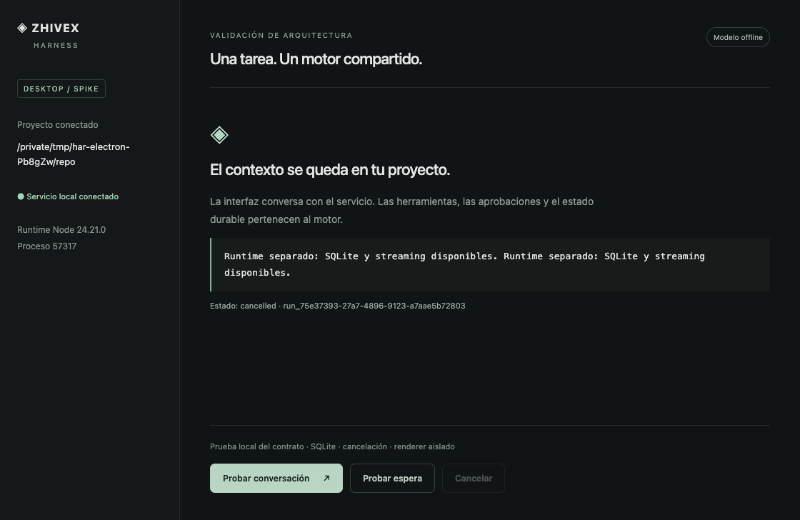

# HAR-HU-26 — Electron + React spike

2026-09-20: accept the architecture for desktop alpha, with explicit distribution
and product-flow limits in [DESKTOP_ARCHITECTURE.md](../DESKTOP_ARCHITECTURE.md).

Verified both the development window and packaged darwin arm64 .app. The packaged
smoke launched outside the checkout with temporary HOME and workspace. Electron
44.4.3 / Node 24.21.0, React 19.3.0. A separate utility process runs the real Harness;
SQLite, streaming and active cancellation pass. Renderer Node access is absent,
the bridge has exactly three methods and forged workspace/project fields fail.

Machine evidence: HAR_HU_26_2026-09-20.json. Screenshot:

Additional macOS OCI smoke passed on Docker 29.8.0 with image
sha256:0e0ff40c39bc087845bfb27465a0df4ea419520094bc35842ff83dd8cbe6f9b6.
This is a separate backend validation; Docker is not included in the .app.

Bun build, desktop TypeScript and docs checks passed. The preceding core/CLI
increment has 627 passing tests; no core source was changed by this spike.
The app package includes bundled dependencies and its own Electron Node runtime,
with no source-directory dependency. Observed packaging issues (Bun's static source
paths and runtime version resolution) were fixed before the packaged smoke passed.

Unsigned app size approximately 310 MB. No live model request, signing, notarization,
clean Gatekeeper installation, updater certification or publication is claimed.
The user explicitly deferred configuring signing. HU27–35 remain open.
