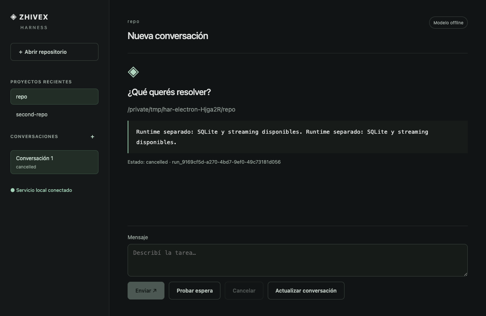

# HAR-HU-27 — projects and conversations in desktop

The macOS desktop now opens with no project selected, offers a native Git repository
picker, persists recent projects, and creates/lists/selects durable conversations
through each project's service. Selecting a project or conversation never starts a
run. Navigation is keyboard-accessible and loading, empty, invalid-repository and
session/transport error states expose recovery actions.

The host owns canonical repository paths. The renderer passes only registered
project keys, and every command/event query binds the corresponding service project.
A project switch cannot redirect an in-flight command or let its result populate a
different view. Each opened project retains its runtime. A single app instance owns
the catalog; another launch focuses the existing window. The private 100-project
index uses validated identities, bounded descriptor reads and serialized atomic writes.

## Evidence

- Bun desktop build and TypeScript checks passed; docs check passed.
- Two registry regression tests, 13 assertions: canonical aliases/nested paths,
  simultaneous saves, reload persistence, preservation of uncommitted files,
  invalid/non-Git paths, forged IDs, symlinks and public file permissions.
- Development Electron and packaged macOS arm64 smoke passed using the actual
  renderer, preload, main process and separate runtime processes.
- Packaged smoke launched from a temporary HOME/workspace with no initial project;
  recovered from a non-Git folder, opened two Git repositories, rejected a session
  from the other project, created independent conversations, used keyboard
  navigation/Enter activation, and restored activity after renderer reload.
- Run identifiers/counts remain identical before and after project/session selection;
  the second project's empty conversation has no execution. Duplicate application
  launch exits without creating another catalog/runtime owner.
- Streaming and cancellation remain verified. Regressions discovered and fixed:
  an old checkpoint could expose a previous run as a cancellation target, and a
  terminal event could release the submit UI before the command response settled.

Machine evidence: HAR_HU_27_2026-09-20.json.

The automated picker uses explicit host fixture paths for deterministic dialog
results; production uses Electron's native directory dialog. The smoke does not
claim to automate the OS dialog itself. No live model request, push, publication,
signing or notarization occurred. The earlier core/CLI suite had 627 passing tests;
this increment changes only desktop code and documentation, not core SDK contracts.
HU28–35 remain open, including complete chat activity, diff/approval UI, crash recovery,
worktrees, Git delivery, secure credentials, signed installation and updates.
