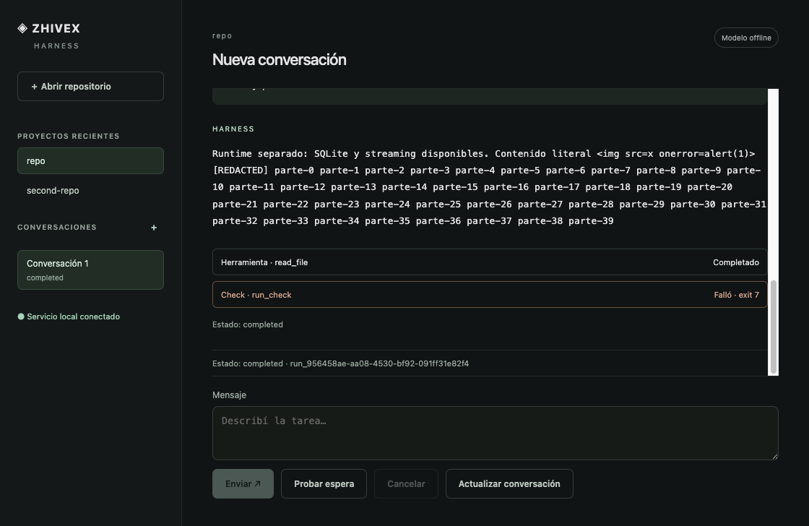

# HAR-HU-28 — durable chat activity and recovery

The desktop now renders per-run user messages, streamed text, tools, check receipts
and statuses. It follows new output while the reader remains at the bottom. Known
host credentials are redacted before durable activity writes and again at the host
bridge. Raw engine output, rich CLI results and approval arguments do not enter the
renderer; repository markup is literal React text. CLI JSONL skips user-message
activity to preserve its existing public event schema.

The replay reducer commits cursor and contents together, ignores duplicate/older
pages, and replaces expired activity with a snapshot containing redacted prompt,
text, status and bounded tool records. Session reads remain available during active
execution without changing revisions. Check exitCode/timedOut are projected from
the actual run_check result; transport success alone never certifies a passing check.

Double submit is blocked synchronously. A lost response after an admitted execution
requires explicit state reconciliation before another send. A failed event poll
keeps the cursor and retries reads; renderer reload and re-selection restore activity
while the separate runtime continues. Navigation status follows the current run.

## Verified evidence

- 633 tests passed, 0 failures, 81 files, 3622 assertions.
- Runtime build, tooling/desktop TypeScript, public contract and docs checks passed.
- CLI/SDK installed package smoke passed after the service changes.
- Final macOS arm64 .app smoke passed from a temporary HOME/repository. It executes
  read_file and an explicitly fixture-approved run_check exiting 7, displays the
  failed receipt, submits the form twice with one admitted run, suppresses a command
  response after actual execution, and reconciles the same run without resending.
- The same package injects temporary transport unavailability and reloads its renderer
  during streaming; an eight-event fixture retention limit forces expired snapshots.
  Prompt, text and failed check recover. A configured secret split across chunks
  never appears in renderer state or returned run metadata, and an img/onerror string
  creates no image or executable content. Additional unit tests cover credentials
  with whitespace split across stream chunks.
- Registry/project/keyboard/isolation scenarios from HU27 still pass in that package.

Machine evidence: HAR_HU_28_2026-09-20.json.

Fault injection is restricted to the trusted host's explicit fixture runtime; it is
not a renderer API. No live provider request, push, publication, signing or notarization
occurred. This verifies the renderer and activity boundary, not a wholesale sanitized
export of historical engine databases or the rich operator CLI document. The diff
and approval interface is HU29; service-process crash/restart and the end-to-end alpha
flow remain HU30. HU29–35 remain open.
