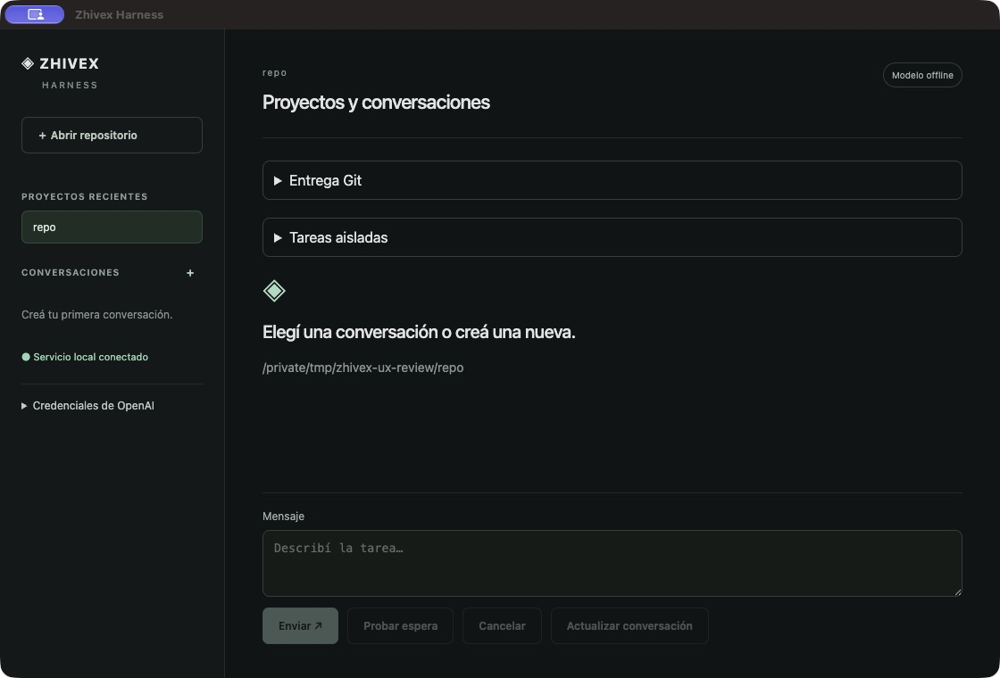
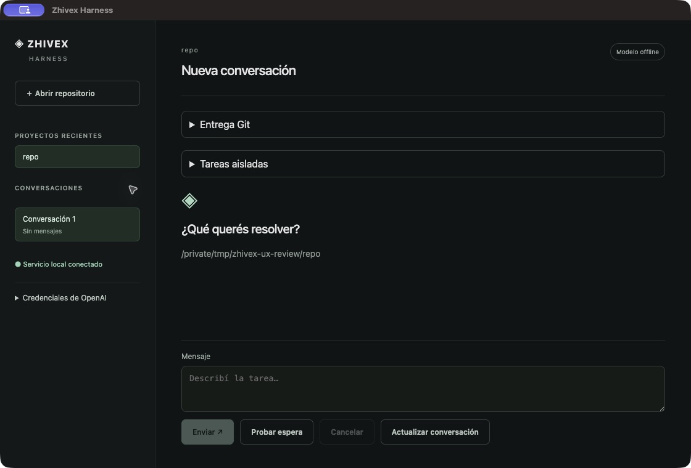
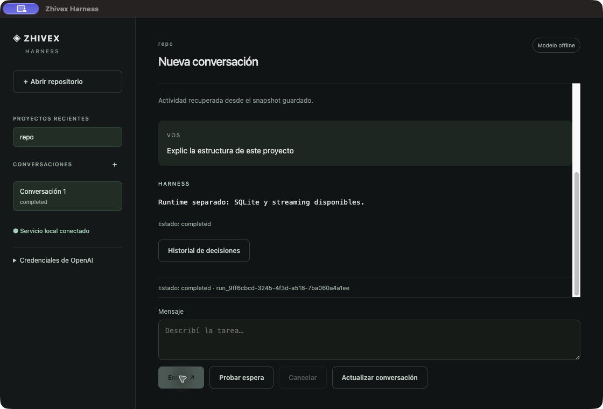
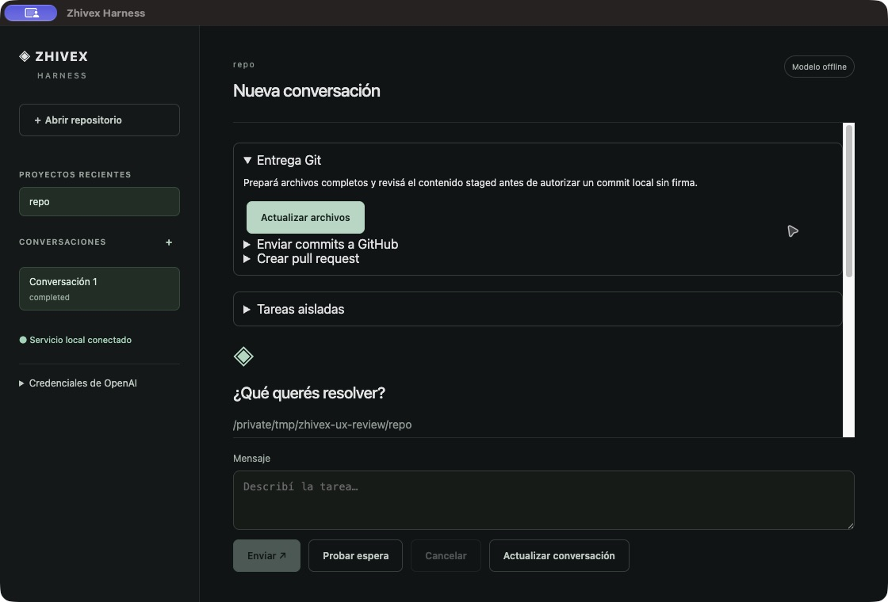

# Zhivex Harness — revisión UX y propuesta visual

Revisión del checkout actual en Electron, compilado con Bun. Modelo offline y repositorio temporal aislado. Las imágenes de propuesta son conceptos, no implementación ni evidencia de ejecución real. Se conserva el cambio preexistente en ReviewPanel.tsx.

## Recorrido observado

1. **Inicio con proyecto abierto — necesita mejorar orientación.** La separación por proyectos y el estado del servicio son claros. Sin embargo, Git y tareas ocupan el primer plano; crear conversación depende de un pequeño signo + lateral mientras el editor está deshabilitado. Propuesta: botón explícito Nueva conversación y bienvenida centrada en el siguiente paso.

2. **Nueva conversación — funcional, jerarquía mejorable.** El editor se habilita correctamente. Git y tareas siguen por encima del contenido principal. Propuesta: contexto de proyecto en cabecera, controles secundarios en vistas separadas y una acción principal en el editor. Probar espera pertenece al modo fixture; no se considera un defecto de producción.

3. **Respuesta — legibilidad y lenguaje mejorables.** Se observa completed en español, estado duplicado y UUID completo. La respuesta se presenta en monoespaciada. Propuesta: lenguaje natural, estado único, texto de lectura normal y detalles técnicos desplegables. Conservar contenido seguro al introducir formato.

4. **Git desplegado — compite con la conversación.** Al abrir Git, el área desplazable queda dominada por entrega, tareas y bienvenida incluso después de haber enviado un mensaje. Propuesta: vista Cambios o panel contextual, bienvenida sólo sin mensajes, revisión con acciones junto al diff.

## Identidad y sistema propuesto

La lámina proporcionada por el usuario es la fuente de marca: isotipo circular Z con nodos, rojo #E60000, negro #000000, gris #F2F2F2 y Montserrat Bold. Usar Montserrat en identidad y títulos; Inter como propuesta complementaria para lectura. Mantener rojo en marca, selección y acción principal. Estados siempre con texto e icono; aprobación pendiente diferenciada en ámbar. Usar originales vectoriales de marca al implementar: las imágenes generadas no son archivos maestros del logo.

Priorizar conversación → propuesta → revisión → aprobación explícita → resultado. Git y tareas deben seguir disponibles sin dominar el inicio. No prometer que los checks se ejecutan automáticamente si el contrato del runtime no lo garantiza.

## Conceptos

- [Imagen 1](01.png): conversación oscura con revisión progresiva.
- [Imagen 2](02.png): superficie clara, navegación oscura y pestañas de contexto.
- [Imagen 3](03.png): conversación y revisión simultáneas.

Generados con Imagegen integrado, adjuntando la lámina de identidad y capturas actuales. Brief común: escritorio 1440 × 1024, español, marca auténtica, tipografía legible, jerarquía sobria, detalles técnicos bajo demanda y separación explícita entre cambios propuestos y aplicados. Variaciones: conversación oscura; espacio claro con pestañas; revisión en panel paralelo.

## Límites y ajustes antes de implementar

No se auditó una aprobación real, credenciales, reconexión ni entrega remota. No hubo pruebas con usuarios, lector de pantalla, medición de contraste ni recorrido completo de teclado. Los tamaños pequeños y textos secundarios requieren validación de contraste, foco y escalado. Los conceptos contienen textos y código ilustrativos: corregir detalles generados como SQLite en el estado de la imagen 1, tratamiento Tú/Vos en la imagen 2 y promesa de checks posteriores en la imagen 3. La última vista debe plegar el panel de revisión en ventanas estrechas. No se modificó la interfaz del producto.
